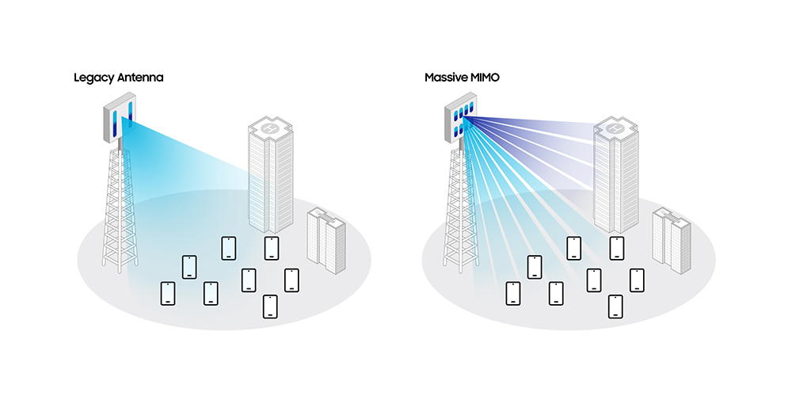
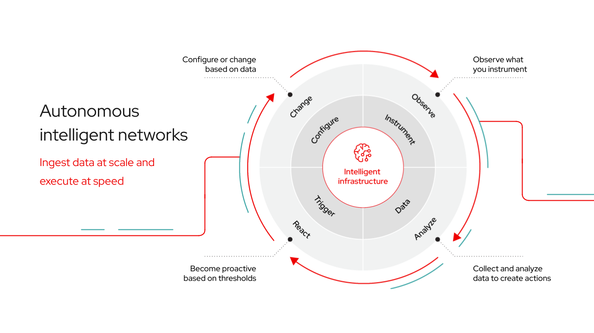
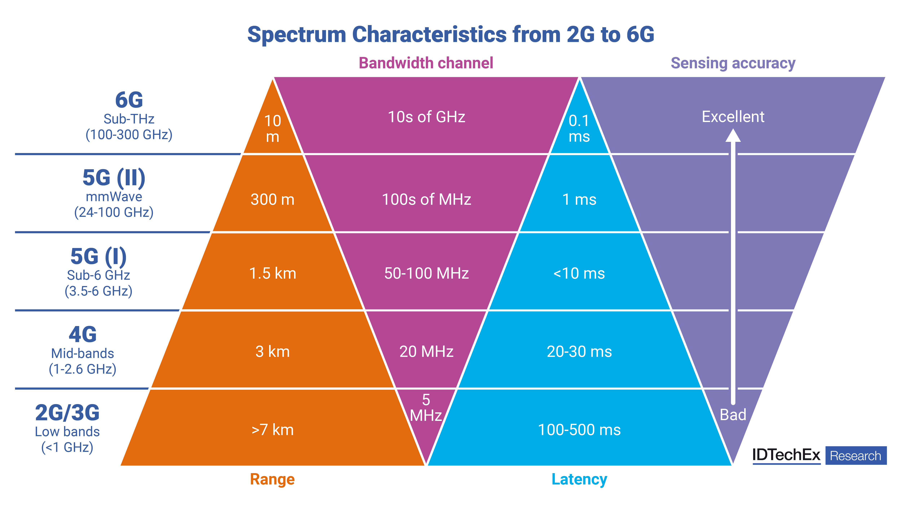
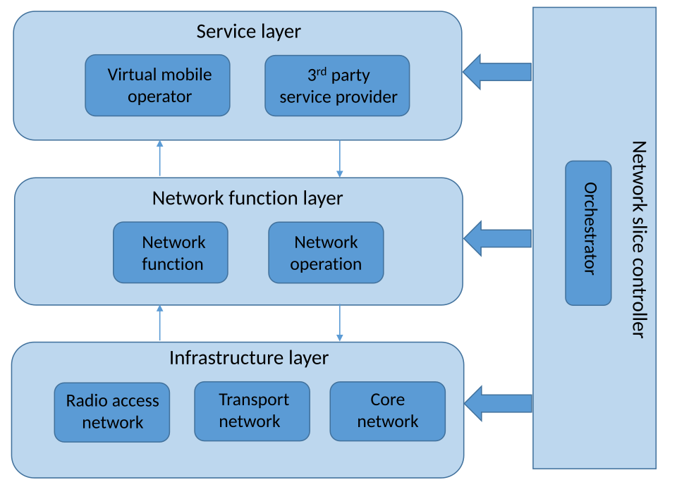
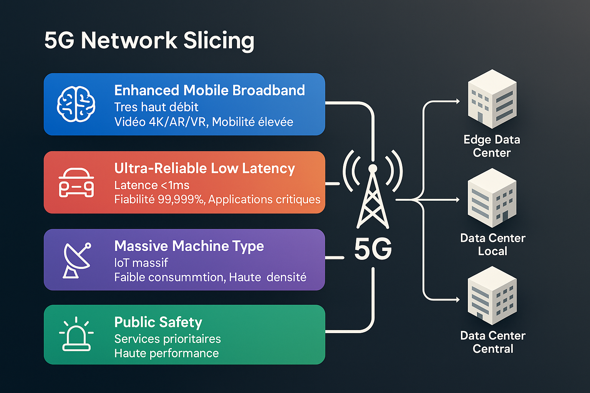

# __Examining the approaches to transitioning from Salvadoran technology to 5G and 6G technology (with emphasis on 6G)__

## project's main ideas


### 1. Mobile Network Genereations 
4G :
- Core Architecture(EPC)
- Internet protocol(IP) transmission
- limitations (latency, network restrictions, and flexibility)

5G :
- Service-Based Architecture(SBA)
    

- Network Slicing
    - 5G network slicing is an architecture that divides a single physical network infrastructure into multiple, independent, and virtualized logical networks. Each "slice" is isolated end-to-end and can be uniquely configured with specific bandwidth, latency, and security parameters tailored to different applications and use cases.
    How It Works
    Software-Defined Networking (SDN): Centralizes the management and routing of data, allowing the network to be programmed on the fly.
    Network Functions Virtualization (NFV): Replaces dedicated hardware (like routers and firewalls) with virtual instances running on standard servers, which can be spun up or down rapidly.
    Isolation: If one slice experiences heavy congestion, it does not impact the performance or security of another slice on the same physical network.

    Primary Use Cases
    Network slicing allows telecom operators to offer highly tailored services and Service Level Agreements (SLAs) to various sectors:

    Enhanced Mobile Broadband (eMBB): Provides dedicated, high-speed, high-capacity bandwidth for consumer smartphones, 4K/8K video streaming, and augmented/virtual reality experiences.
    Ultra-Reliable Low-Latency Communication (URLLC): Prioritizes near-instantaneous response times (crucial for mission-critical tasks like autonomous driving, remote robotic surgery, and industrial automation).
    Massive Machine-Type Communication (mMTC): Optimized for low-power, wide-area IoT devices (such as smart city sensors and smart meters) that transmit small amounts of data intermittently.
    Enterprise / Private Slicing: Businesses can lease custom slices that function as secure, private corporate networks to connect employees and branch offices globally.

    Benefits
    Resource Optimization: Service providers can allocate resources exactly where and when they are needed, rather than over-provisioning the entire network.
    Tailored Performance: Ensures that latency-sensitive applications aren't competing for bandwidth with data-heavy consumer applications.
    Cost Efficiency: Reduces the need for enterprises and operators to build, maintain, and manage multiple separate physical networks.


- Massive MIMO

    - Massive MIMO (Multiple Input, Multiple Output) is awireless network technology that combines dozens to hundreds of antennas on a single base stationBy intelligently bundling and directing signals, it significantly improves the capacity, speed, and coverage of mobile 5G networks.
    

    How it works
    Beamforming: Instead of transmitting data in a wide circle, the many antennas bundle the signal into focused beams directly to your device.
    Multi-User MIMO: Thanks to the many antennas, the system can serve dozens of devices simultaneously on exactly the same radio frequency, without them interfering with each other.
    Spatial multiplexing: Because each antenna transmits a separate signal, the data transfer is, as it were, divided into parallel lanes.

    The main benefits
    Higher speeds: Because signals are specifically directed at your phone, the signal strength is optimal and download speeds are maximized.
    Less interference: Targeted signals lead to less interference with other users.
    Greater capacity: Because the same frequency is efficiently reused for multiple devices simultaneously, busy places such as stadiums and festivals can be seamlessly provided with fast internet.


- Edge Computing
    - 5G provides the high-speed, high-bandwidth, and low-latency wireless connection needed to transfer vast amounts of data from devices to the edge of the network. Edge computing places processing power closer to the data source, such as a local server or the network's edge, to analyze and process data immediately.
    
    - Much of the value of AI and GenAI applications is reliant on them being able to __think__ in real time. For many applications, 5G and edge computing are the best combination of technologies to enable the lowest latency to deliver real-time inferencing. Rather than hosting an AI model in the hyperscale cloud, models can be trained in the hyperscale cloud and then run at the edge, with 5G delivering fast data rates between the edge node and the end user. 
    

- Ultra Low Latency


6G :
- THz communication
    - As the world moves toward the era of 6 G wireless networks, the demand for ultra-high-speed, ultra-low-latency, and intelligent communication systems has accelerated. Emerging applications such as holographic communication, tactile internet, immersive Extended Reality (XR), digital twins, and autonomous systems require data rates in the terabits-per-second (Tbps) range and latency as low as microseconds. These performance requirements exceed the capabilities of current 5 G systems and demand a fundamental shift in the design and operation of wireless networks. One of the most promising enablers of 6 G is terahertz (THz) communication, which operates in the frequency range of 100 GHz to 10 THz. Terahertz bands offer massive bandwidth that can support unprecedented data rates and spectral efficiency. 
    


- AI-native Networks
    - AI-native networks refer to a new architecture in telecommunications where artificial intelligence and machine learning are not merely add-ons or tools integrated into existing systems, as they were in previous generations. Instead, they are embedded from the ground up into the foundational design of the network, from the physical layer and antennas to the core management layer. In this paradigm, the network transforms into a self-organizing, intelligent, and dynamic entity capable of continuously analyzing environmental data and altering its behavior in real time based on instantaneous conditions.

    - The fundamental advantage of this technology is unprecedented network resource optimization and a dramatic increase in efficiency. AI-native networks can predict user traffic patterns, manage the bandwidth and power consumption of antennas in fractions of a second, and minimize frequency interference. This not only significantly reduces operational expenses (OPEX) for operators but also drastically elevates the Quality of Experience (QoE) for users by minimizing dropouts and automatically optimizing speeds. Furthermore, the ability to intelligently detect and respond to cyberattacks the moment they occur is another key strength of this architecture.
    
    - However, implementing this level of artificial intelligence within the 6G cellular framework comes with major challenges. Training and running deep learning models on a national scale requires massive computational power and energy consumption, which could paradoxically undermine the network’s energy-efficiency benefits. On the other hand, the "black box" nature of AI models and the uncertainty in their decision-making processes pose risks to network management during critical failures. Additionally, the extensive collection of user data required to train these models will create severe legal and security concerns regarding personal privacy.


- Information Sharing and Analysis Center(ISAC)
    - The concept of ISAC in the context of 6G goes far beyond its traditional definition in cybersecurity; in the sixth generation, this term is intrinsically tied to Integrated Sensing and Communication. Its primary role is the intelligent collection, analysis, and sharing of environmental and security data. In this structure, the cellular network's radio signals do more than just transmit data; they act like a radar, scanning the surrounding environment (detecting object positions, movement speeds, and even vital signs) so that this information can be analyzed and shared across a secure platform.

    - The positive aspects and key applications of ISAC are truly transformative. This technology allows the network to create a digital twin of the physical environment without the need for separate radar hardware. This capability is vital for the management of autonomous vehicles, drones, and industrial automation, as traffic data and physical obstacles can be shared across all network components with centimeter-level accuracy and zero delay. Moreover, enhancing the physical and cyber security of telecom sites through continuous signal monitoring and anomaly detection stands out as a major benefit.
    
    - The primary challenge of implementing ISAC in a cellular environment is the optimal allocation of limited radio resources between two entirely different tasks: communication and sensing. Prioritizing one can easily degrade the quality of the other. Furthermore, processing raw radar data received from millions of cellular antennas imposes a massive computational burden on the network edge. From a social and legal standpoint, the fact that a cellular network can track the precise location and movement of individuals—even without them carrying a smartphone—raises deep concerns regarding privacy violations and mass surveillance.


- Holographic communication
    - Holographic communication represents the next generation of video and interactive technologies, enabling the transmission of high-definition, full-color, 3D images of people and objects in real time within a physical environment. Unlike current 2D video calls or Virtual Reality (VR) that require heavy, isolating headsets, this technology manipulates and reconstructs light waves in a way that makes the user feel as though the other person is physically present in the room. This technology will serve as the core foundational infrastructure for a true metaverse and ultra-advanced remote collaboration.
    
    - The main benefit of this technology is creating an absolute sense of physical presence (telepresence) and erasing geographical boundaries. This opens up revolutionary applications in telemedicine (such as guided complex remote surgeries), interactive 3D education, and international business meetings. From a technical standpoint, because these communications require the precise reconstruction of optical wavefronts, they allow for completely natural interaction with the surrounding environment, fostering a new level of empathy and efficiency in digital human relations.
    
    - Yet, deploying live holograms over 6G cellular networks faces monumental technical barriers. Transmitting a high-quality hologram with natural refresh rates demands an ultra-massive bandwidth scaled in gigabits or even terabits per second, which is incredibly difficult to guarantee across cellular mobile layers. To achieve this bandwidth, the network must migrate to Terahertz (THz) frequencies; however, these frequencies have an extremely short range, are easily blocked by physical obstacles (even a human hand or rain), and make maintaining a stable holographic stream during user mobility nearly impossible.


- Microsecond Latency
    -Microsecond latency refers to reducing the network's Round-Trip Time (RTT) to less than a single millisecond, specifically aiming for around 100 microseconds. While 5G realized the dream of millisecond latency for commercial applications, 6G enters the microsecond realm to keep pace with the processing speeds of ultra-fast biological and mechanical systems. This feature is the ultimate key to instantaneous, real-time interactions in the world of machines and the Industrial Internet of Things (IIoT).

    

    - The key advantages of this negligible latency manifest in time-critical scenarios. In the smart factories of the future, synchronized robotic arms must react to assembly line errors within a fraction of a millisecond. Similarly, in remote robotic surgeries or the high-speed control of drone fleets, any latency beyond a few microseconds could result in catastrophe. This feature also unlocks the Haptic Internet, where the physical sense of touch must be transmitted and received across the network instantaneously without any perceptible lag.

    - Achieving microsecond latency within a cellular infrastructure hits hard physical limits, primarily because the speed of light in fiber optics and air is finite; simply traveling long geographical distances inherently adds latency. Therefore, the cellular network is forced to process all data at the closest possible point to the user (the extreme network edge), requiring an immense deployment of localized micro-data centers across cities. Additionally, physical layer protocols and Forward Error Correction (FEC) mechanisms in cellular systems inherently introduce delays, and redesigning them without sacrificing signal stability remains an extraordinarily complex engineering challenge.
- Autonomous Networks 
    - Autonomous networks refer to intelligent telecommunication systems capable of executing all their management, operational, and maintenance processes without direct human intervention or programming. These networks are engineered around the core principles of self-configuration, self-optimization, and self-healing. Operating much like an autopilot system, the network continuously monitors its current state, makes localized decisions, and applies the necessary structural modifications to maintain the strict Quality of Service (QoS) required.
    
    - The primary advantage of this technology is its ability to manage the overwhelming complexity of 6G networks. With the influx of millions of small cells and billions of connected IoT devices, manual network management becomes humanly impossible. Autonomous networks drastically reduce maintenance costs and slash fault-response times to mere seconds; for instance, if a cellular tower fails, neighboring networks automatically adjust their beam angles and transmission power to cover the newly formed blind spot. These systems also improve total network energy efficiency by automatically powering down low-traffic sectors.

    - The greatest hurdle on the path to fully autonomous networks is system coordination complexity and reliability. Handing over complete control of a critical national infrastructure to autonomous AI algorithms introduces the terrifying risk of unpredictable cascading failures, where a single flawed optimization decision by the system could trigger a widespread blackout across the entire network. Furthermore, the lack of unified standards and protocols among different equipment manufacturers (such as Nokia, Ericsson, and Huawei) means that deploying a cohesive autonomous umbrella over a country's mixed cellular network will face severe software compatibility conflicts.


### 2. Path Analysis



- From EPC to 5G
    - The migration journey begins with a fundamental transformation of the network's software paradigm. Before altering physical antennas, operators must overhaul the underlying operating environment. In this phase, massive, monolithic legacy telecom software systems are broken down and deployed as lightweight, containerized microservices (using platforms like Docker and Kubernetes) on commercial off-the-shelf (COTS) hardware. This cloud-native architecture provides the dynamic scalability required to manage future network generations.
    
        - Infrastructure & Changes: Decommissioning proprietary telecom operating systems and replacing them with container orchestration platforms and cloud-automation tools (DevOps).

        > Cost & Challenge: Medium cost. The primary hurdle lies in refactoring old, monolithic telecom code into a microservices architecture and retraining the engineering workforce.


- 4G and 5G Intercation(NSA/SA)
    - With the cloud infrastructure successfully established, the migration moves to the heart of the network: the Core. In this step, operators transition network control from the 4G Evolved Packet Core (EPC) to a Standalone 5G Core (5GC). This shift completely virtualizes network functions, allowing operators to activate critical capabilities like network slicing (partitioning a single physical network into multiple virtual networks). This step is a non-negotiable prerequisite for entering the 6G era.

        - Infrastructure & Changes: Retiring expensive, proprietary legacy hardware and deploying software-defined core network functions onto centralized data center servers.
        
        > Cost & Challenge: Medium to high cost. The biggest challenge here is migrating massive subscriber databases to the new core environment without causing a single second of service disruption.

- 6G Infrastructure Preparation
    -Once the core is modernized, the evolution moves outward toward the edge of the network and the Radio Access Network (RAN). In this phase, proprietary hardware locks on antennas are broken by adopting Open RAN (O-RAN) principles, decoupling antenna hardware from controlling software. Concurrently, to drive latency down, heavy core processing functions are pushed out of central offices and redistributed into small, localized edge data centers (Edge Cloud) situated right next to cellular towers.

    - Infrastructure & Changes: Installing open-standard "White-box" antennas and deploying miniature edge data center nodes across urban radio sites.

    > Cost & Challenge: Very high cost. Ensuring seamless interoperability between hardware components from different vendors under an open standard, while managing a highly distributed data architecture, poses a steep engineering challenge.


- What will happen to _Core Network_ and _RAN_ ?
    - Until the 6G infrastructure is fully deployed, the new network layers cannot operate in isolation. During this transitional phase, the system must seamlessly manage the coexistence of existing generations (4G and 5G). Utilizing advanced techniques such as Dual Connectivity (EN-DC) and Dynamic Spectrum Sharing (DSS), cell towers learn to intelligently split existing frequency bands between multi-generation users in real time, guaranteeing continuous network coverage.

    - Infrastructure & Changes: Applying sophisticated software updates to antennas so they can concurrently process multi-generation signals and eliminate inter-frequency interference.

    > Cost & Challenge: The lowest cost phase in the entire roadmap. The core challenge involves fine-tuning radio frequency profiles to prevent any drop in the quality of experience for legacy users.


- Cloud-Native Architecture 
    - In the final phase of the process—backed by a mature cloud-native foundation, an upgraded standalone core, distributed edge data centers, and an open radio network—the stage is set to introduce 6G’s terabit-per-second Terahertz (THz) frequencies. Because these ultra-high frequencies have an incredibly short range, the final infrastructure layer is completed by deploying millions of miniature transmitters (Small Cells) across urban furniture. Simultaneously, the fiber-optic backhaul must be vastly upgraded to sustain these astronomical speeds.

    - Infrastructure & Changes: Extensive civil engineering for fiber-optic expansion, mass deployment of miniature cells on utility poles and walls, and embedding an AI-native framework to manage this ultra-dense cell grid.

    > Cost & Challenge: Extraordinarily expensive and capital-intensive. The ultimate hurdles are the skyrocketing construction costs, powering millions of small cells, and maintaining signal stability across highly sensitive Terahertz bands.


### 3. Technology Transfer Challenges 

- Infrasructure costs

- Complexity of Intergenerational Coexistence 

- Need For New Frequency Spectrum 

- Security 

- High Denpendency of Software and AI


__this is a bold text__
_this is an italic text_

my list :
- hello
- goodbye

my ordered list : 
1. hello 
2. goodbye 


here is my link :

[google](google.com)


`
here is the code 
`
```
here is the code
hello
```

```python
from numpy import np
```


> here is my text
>

> fkinjrfjfn
> rlfrf
> rfkfm


---

hello

***

hello 





